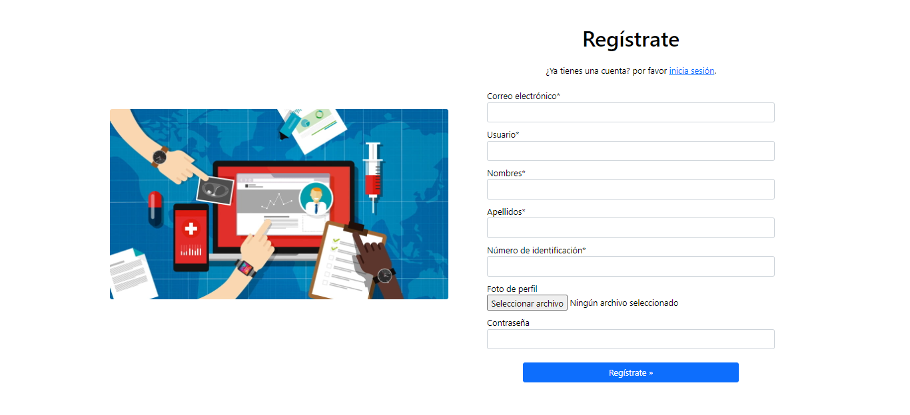
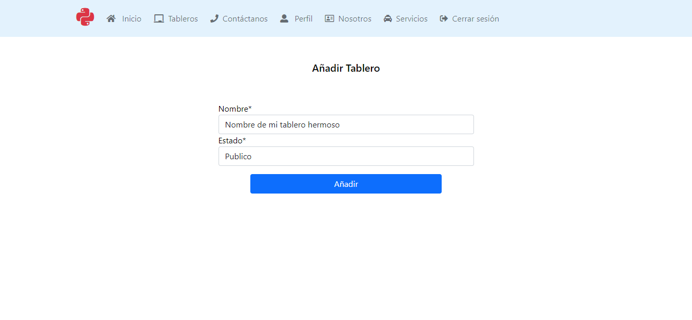
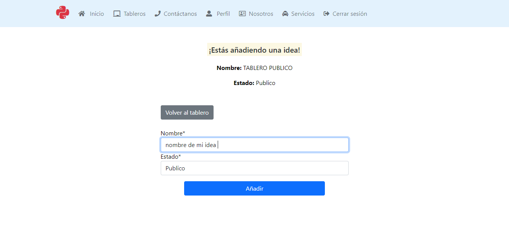
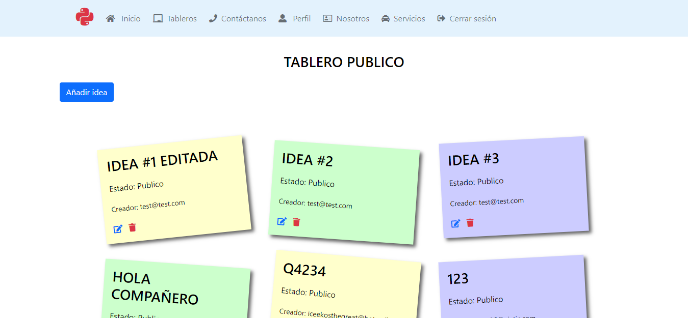
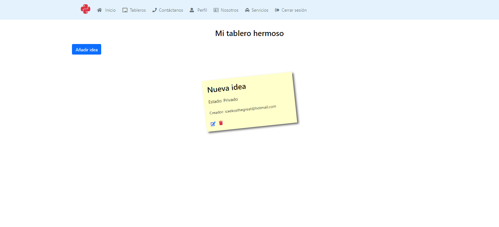
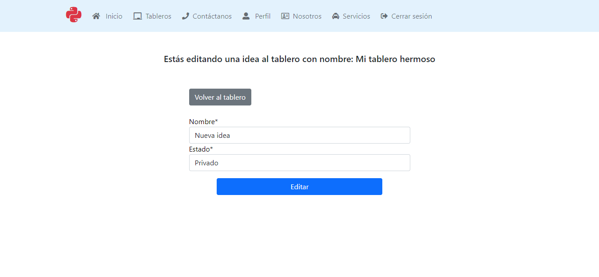
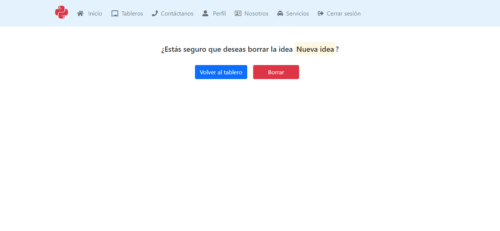

# Desarrollo Ejercicio 1

Sobre qué se trataba el ejercicio 1 fue definido en la sección de ejercicios, puedes ir haciendo [click aquí](ejercicios.md#informacion-sobre-ejercicio-1)

El ejercicio pedía que el usuario se pudiera registrar por

* Email o usuario
* Contraseña 
* Nombres
* Apellidos
* Número de identificación
* Foto

## Registro de usuario

Con el objetivo de cumplir esta especificación se definieron los siguietes modelos y funciones en el archivo  ``models.py ``

    # Función para subir la imagen de usuario
    def img_uploader(instance, image_name):
        image_name = 'user_images/{0}/profile.jpg'.format(instance.username)
        full_path = os.path.join(settings.MEDIA_ROOT, image_name)
        if os.path.exists(full_path):
            os.remove(full_path)
        return image_name

    # Modelo reescrito para cuando se cree un usuario normal o superadmin
    class UserManager(BaseUserManager):
        use_in_migrations = True

        def _create_user(self, email, username, first_name, last_name, id_num, password, **extra_fields):
            if not email:
                raise ValueError('Correo electrónico obligatorio.')
            if not username:
                raise ValueError('Nombre de usuario obligatorio')
            if not first_name:
                raise ValueError('Los nombres son obligatorios')
            if not last_name:
                raise ValueError('Apellidos son obligatorios')
            if not id_num:
                raise ValueError('Número de identificación obligatorio')

            user = self.model(
                email=self.normalize_email(email),
                username=username,
                first_name=first_name,
                last_name=last_name,
                id_num=id_num,
                last_login=timezone.now(),
                date_joined=timezone.now(),
                **extra_fields
            )
            user.set_password(password)
            user.save(using=self._db)
            return user

        def create_user(self, email, username, first_name, last_name, id_num, password=None, **extra_fields):
            extra_fields.setdefault('is_staff', False)
            extra_fields.setdefault('is_admin', False)
            return self._create_user(email, username, first_name, last_name, id_num, password, **extra_fields)

        def create_superuser(self, email, username, first_name, last_name, id_num, password=None, **extra_fields):
            extra_fields.setdefault('is_staff', True)
            extra_fields.setdefault('is_admin', True)

            if extra_fields.get('is_staff') is not True:
                raise ValueError('Super usuario debe ser personal.')
            if extra_fields.get('is_admin') is not True:
                raise ValueError('Super usuario debe ser administrador.')

            return self._create_user(email, username, first_name, last_name, id_num, password, **extra_fields)

    # Modelo de usuario para registro
    class User(AbstractBaseUser):
        email = models.EmailField(
            max_length=255, verbose_name='Correo electrónico', unique=True)
        username = models.CharField(
            max_length=28, verbose_name='Usuario', unique=True, default='')
        first_name = models.CharField(
            max_length=80, verbose_name='Nombres', default='')
        last_name = models.CharField(
            max_length=80, verbose_name='Apellidos', default='')
        id_num = models.CharField(
            max_length=12, verbose_name='Número de identificación', unique=True)
        date_joined = models.DateTimeField(
            verbose_name="Creado en", auto_now_add=True)
        last_login = models.DateTimeField(
            verbose_name="Último inicio de sesión", auto_now=True)
        profile_picture = models.ImageField(
            verbose_name="Foto de perfil", default="no_profile.jpg", upload_to=img_uploader, blank=True)

        is_active = models.BooleanField(verbose_name="Activo", default=True)
        is_admin = models.BooleanField(
            verbose_name="Administrador", default=False)  # a superuser
        # a admin user; non super-user
        is_staff = models.BooleanField(verbose_name="Personal", default=False)

        USERNAME_FIELD = 'username'
        REQUIRED_FIELDS = ['email', 'id_num', 'first_name', 'last_name']

        objects = UserManager()

        def __str__(self):
            return self.email

        def get_full_name(self):
            # El usuario es identificado por su nombre
            return self.first_name

        def get_short_name(self):
            # EL usuario es identificado por su apodo
            return self.username

        @staticmethod
        def has_perm(self, *args, **kwargs):
            return True

        @staticmethod
        def has_module_perms(self, *args, **kwargs):
            return True

Después se procedió a definir el formulario en el archivo ``forms.py`` el cual es utilizado por el usuario en el registro

    class RegistrationForm(forms.ModelForm):
        password = forms.CharField(label='Password', widget=forms.PasswordInput)

        class Meta:
            model = User
            fields = ['email', 'username', 'first_name',
                    'last_name', 'id_num', 'profile_picture', 'password']

        def save(self, commit=True):
            # Save the provided password in hashed format
            user = super().save(commit=False)
            user.set_password(self.cleaned_data["password"])
            if commit:
                user.save()
            return user

Luego con el fin de utilizar este modelo de usuario y formulario de registro al crear una nueva cuenta local se procedió a realizar la configuración pertinente en el archivo ``settings.py``

    AUTH_USER_MODEL = 'api.User'
    ACCOUNT_FORMS = {
        'signup': 'api.forms.RegistrationForm'
    }

``api`` es el nombre de la aplicación creada en Django, se le dice que vaya a la aplicación ``api`` extraiga el usuario y uselo como modelo de autenticación, adicionalmente se le dice que reemplace el formulario que viene por defecto con las vistas de django-allauth por el formulario definido anteriormente y listo, de esta forma se logra cambiar el formulario con los requerimientos planteados por el ejercicio.

### Resultado

## Tableros

Los tableros tienen la caracteristica de ser públicos o privados los tableros publicos reciben ideas de todos, mientras los privados solo el dueño el tablero puede añadir ideas, splo dueño del tablero puede hacer un CRUD de todas las ideas recibidas

Con el fin de cumplir las especificaciones descritas anteriormente se crearon los siguientes modelos en el archivo ``models.py``

    class Board(models.Model):

        PUBLIC = 'PU'
        PRIVATE = 'PR'
        BOARD_STATUS = [
            (PUBLIC, 'Publico'),
            (PRIVATE, 'Privado')
        ]
        name = models.CharField(verbose_name="Nombre", max_length=36)
        owner = models.ForeignKey(User, on_delete=models.CASCADE, null=True)
        status = models.CharField(verbose_name="Estado",
                                max_length=2, choices=BOARD_STATUS, default=PUBLIC)
        created_at = models.DateTimeField(auto_now_add=True)
        updated_at = models.DateTimeField(auto_now=True)

        def __str__(self):
            return f"{ self.id } - { self.name } | { self.owner }"

    class Ideas(models.Model):
        PUBLIC = 'PU'
        PRIVATE = 'PR'
        BOARD_STATUS = [
            (PUBLIC, 'Publico'),
            (PRIVATE, 'Privado')
        ]
        board = models.ForeignKey(
            Board, verbose_name="Tablero", on_delete=models.CASCADE, null=True)
        owner = models.ForeignKey(User, verbose_name= "Creador", on_delete=models.CASCADE, null=True)
        name = models.CharField(max_length=36, verbose_name= "Nombre",)
        status = models.CharField(
            max_length=2, choices=BOARD_STATUS,verbose_name= "Estado", default=PUBLIC)
        created_at = models.DateTimeField(auto_now_add=True)
        updated_at = models.DateTimeField(auto_now=True)

        def __str__(self):
            return f"{ self.id } - { self.name } | { self.owner }"

Ambos modelos tienen definidos sus campos y sus relaciones con el fin de buscar qué ideas pertenecen a qué tablero.
Una vez definidos los modelos se procedió a crear los 2 formularios en el archivo ``forms.py`` estos formularios se utilizarán en las respectivas vistas definidas dentro del archivo ``views.py`` en cual veremos más abajo.

``forms.py``

    # Tablero

    class AddBoard(forms.ModelForm):
        class Meta:
            model = Board
            fields = ('name', 'owner', 'status')
            # Campo oculto, aquí se hace la relación del creador del tablero en el archivo views.py
            widgets = {
                'owner': forms.HiddenInput(),
            }

        def form_valid(self, form):
            form.save()
            return super().form_valid(form)
    
    # Idea

    class AddIdea(forms.ModelForm):
        class Meta:
            model = Ideas
            fields = ('board', 'owner', 'name','status')
            # Campos ocultos, se hace la relación del creador de la idea y a qué tablero pertenece en el archivo views.py
            widgets = {
                'owner': forms.HiddenInput(),
                'board': forms.HiddenInput(),
            }

        def form_valid(self, form):
            form.save()
            return super().form_valid(form)

Una vez definidos los modelos y los formularios se procede a definir las vistas que utilizaran estos formularios en el archivo ``views.py``

    # Vista para añadir un Tablero

    class AddBoardView(CreateView):
        # Se define el modelo que utilizará cando se haga una petición POST al formulario
        model = Board
        # Se define el formulario que utilizará
        form_class = AddBoard
        # Se define el template html que utilizará (este es el que despliega el form de html)
        template_name = 'form-board.html'
        # la ruta a la que redigirá en caso de exito
        success_url = '/accounts/boards/new/'

        def get_initial(self, *args, **kwargs):
            initial = super().get_initial(*args, **kwargs)
            # se define el campo owner del formulario como el usuario que tiene la sesión iniciada
            initial['owner'] = self.request.user
            return initial

        def form_valid(self, form):
            # se envía mensaje de success cuando el formulario es valido
            messages.success(
                self.request, f"El tablero ha sido creado exitosamente!")
            return super().form_valid(form)

    # Vista para añadir una idea a un tablero

    class AddIdeaView(CreateView):

        model = Ideas
        form_class = AddIdea
        template_name = 'form-idea.html'
        success_url = reverse_lazy('boards_id')
        pk = None

        # En esta parte se definen variables las cuales contienen busquedas realizadas a la base de datos y se almacenan en owner y board
        # estas viarbales se utilizan en el HTML para mostrar información
        def get_context_data(self, **kwargs):
            context = super().get_context_data(**kwargs)
            context['owner'] = self.request.user
            context['board'] = Board.objects.get(pk=self.kwargs.get('pk'))
            return context
        # Se definen los valores iniciales a los campos de la idea, estos campos están ocultos y fueron definidos de esta forma en el archivo forms.py
        def get_initial(self, *args, **kwargs):
            initial = super().get_initial(*args, **kwargs)
            initial['owner'] = self.request.user
            initial['board'] = Board.objects.get(pk=self.kwargs.get('pk'))
            initial['status'] = Board.objects.get(pk=self.kwargs.get('pk')).status
            return initial
        # En esta parte se valida antes de agregar una idea si el formulario es publico o privado, si el usuario tiene permiso o no para añadir la idea y enviar un mensaje de respuesta
        def form_valid(self, form):
            db_board = Board.objects.get(pk=self.kwargs.get('pk'))

            if db_board.status == 'PU':
                messages.success(
                    self.request, f"La idea ha sido añadida al tablero exitosamente!")
                self.pk = self.kwargs.get('pk')
                return super().form_valid(form)
            else:
                if (str(db_board.owner) == str(self.request.user.email)):
                    messages.success(
                        self.request, f"La idea ha sido añadida al tablero privado exitosamente!")
                    self.pk = self.kwargs.get('pk')
                    return super().form_valid(form)
                else:
                    messages.error(
                        self.request, f"Este tablero es privado y solo el dueño del mismo puede añadir notas.")
                    form.add_error(
                        field="owner", error="Este tablero es privado y solo el dueño del mismo puede añadir notas.")
                    return super().form_invalid(form)
        # se redefine la URL de success para que lleve a la misma pantalla en caso de que el usuario quiera crear más ideas
        def get_success_url(self):
            #print(self.pk)
            return reverse('create_idea', kwargs={'pk': self.pk})

### Resultados

**Añadir Tablero**

**Añadir idea a un tablero**

**Resultado de idea añadida a un tablero**

A continuación se mostrará la vista definida para mostrar todos los tableros creados por los usuarios, esta vista agrupa los tableros por 3 tipos

* Tableros propios o creados por el usuario
* Tableros publicos (incluye los tableros que el usuario creó si son publicos)
* Tableros privados (incluye los tableros que el usuario creó si son privados)

Archivo ``views.py``

    class BoardsView(TemplateView):

        template_name = 'boards.html'
        # Aquí se definen las variables que serán utilizadas en el HTML para mostrar los tableros
        def get_context_data(self, **kwargs):
            context = super().get_context_data(**kwargs)
            context['boards'] = Board.objects.all()
            context['public_boards'] = Board.objects.filter(status='PU')
            context['private_boards'] = Board.objects.filter(status='PR')
            context['my_boards'] = Board.objects.filter(owner=self.request.user.id)
            return context

**Resultados**

A continuación se mostrará las vistas definidas para mostrar la información de este tablero (las ideas que contiene este)

Archivo ``views.py``

    class BoardDetailView(DetailView):

        model = Board
        template_name = 'board-detail.html'
        context_object_name = "board"
        # se define la funcion get la cual revisa si el tablero existe, si no lo hace entonces redirige a la pantalla de todos los tableros
        def get(self, request, *args, **kwargs):
            try:
                return super().get(request, *args, **kwargs)
            except Http404:
                return redirect(reverse('boards'))
        # se hace una consulta a la coleccion de ideas la cual tenga el campo board igual al parametro enviado por la url
        def get_context_data(self, **kwargs):
            context = super().get_context_data(**kwargs)

            context['ideas'] = Ideas.objects.filter(board=self.kwargs.get('pk'))

            return context

**Resultado información de un tablero**

Después se procedio a configurar las vistas para permitir al usuario editar o eliminar ideas creadas en un tablero dependiendo de las restricciones mencionadas anteriormente

Archivo ``views.py``

    # Vista para borrar una idea de un tablero, aquí se valida si el usuario tiene permiso o no dependiendo de las restricciones declaradas anteriormente

    class DeleteIdeaView(DeleteView):
        # specify the model you want to use
        model = Ideas
        form_class = AddIdea
        template_name = 'form-delete-idea.html'
        success_url = reverse_lazy('boards_id')

        def get_context_data(self, **kwargs):
            context = super().get_context_data(**kwargs)
            context['owner'] = self.request.user
            context['board'] = Board.objects.get(pk=self.kwargs.get('pk2'))
            context['idea'] = Ideas.objects.get(pk=self.kwargs.get('pk'))
            return context

        def get(self, request, *args, **kwargs):
            try:
                return super().get(request, *args, **kwargs)
            except Http404:
                return redirect(reverse('boards_id',  kwargs={'pk': self.kwargs.get('pk2')}))

        def delete(self, request, *args, **kwargs):
            db_idea = Ideas.objects.get(pk=self.kwargs.get('pk'))
            db_board = Board.objects.get(pk=self.kwargs.get('pk2'))

            if ((str(db_idea.owner) == str(self.request.user.email)) or (str(db_board.owner) == str(self.request.user.email))):
                return super(DeleteIdeaView, self).delete(
                    request, *args, **kwargs)
            else:
                messages.error(
                    self.request, f"Solo puedes borrar la idea si eres el creador de la misma o el dueño del tablero")
                return redirect(reverse('delete_idea', kwargs={'pk2': self.kwargs.get('pk2'), 'pk': self.kwargs.get('pk')}))

        def get_success_url(self):
            return reverse('boards_id', kwargs={'pk': self.kwargs.get('pk2')})

    # Vista para editar una idea de un tablero, aquí se valida si el usuario tiene permiso o no dependiendo de las restricciones declaradas anteriormente
    
    class EditIdeaView(UpdateView):

        model = Ideas
        form_class = AddIdea
        template_name = 'form-edit-idea.html'
        success_url = reverse_lazy('update_idea')
        pk2 = None

        def get_context_data(self, **kwargs):
            context = super().get_context_data(**kwargs)
            context['owner'] = self.request.user
            context['board'] = Board.objects.get(pk=self.kwargs.get('pk2'))
            context['idea'] = Ideas.objects.get(pk=self.kwargs.get('pk'))
            return context

        def get(self, request, *args, **kwargs):
            try:
                return super().get(request, *args, **kwargs)
            except Http404:
                return redirect(reverse('boards_id',  kwargs={'pk': self.kwargs.get('pk2')}))

        def form_valid(self, form):
            db_idea = Ideas.objects.get(pk=self.kwargs.get('pk'))
            db_board = Board.objects.get(pk=self.kwargs.get('pk2'))

            if ((str(db_idea.owner) == str(self.request.user.email)) or (str(db_board.owner) == str(self.request.user.email))):
                messages.success(
                    self.request, f"La idea ha sido editada exitosamente!")
                self.pk2 = self.kwargs.get('pk2')
                return super().form_valid(form)
            else:
                messages.error(
                    self.request, f"Solo puedes editar la idea si eres el creador de la misma o el dueño del tablero")
                form.add_error(
                    field="owner", error="Solo puedes editar la idea si eres el creador de la misma  o el dueño del tablero")
                return super().form_invalid(form)

        def get_success_url(self):
            #print(self.pk)
            return reverse('update_idea', kwargs={'pk2': self.kwargs.get('pk2'), 'pk': self.kwargs.get('pk')})

**Resultados**

**Editar**

**Borrar**

## Django Api REST framework

Se necesitaba crear los siguientes endpoints

| Método http | Endpoint     | Descripción                                                                                    |
|-------------|--------------|------------------------------------------------------------------------------------------------|
| Post        | /token       | Método que permite obtener un token de autenticación mediante username y password.             |
| Get         | /users       | Método que retorna el listado de todos los usuarios con sus diferentes atributos.              |
| Get         | /boards      | Método que retorna todos los tableros creados, permitir filtrar por estrado (privado, público) |
| Post        | /boards      | Método que permite crear un tablero por nombre y estado.                                       |
| Get         | /ideas       | Método que retorna todos las ideas creadas por usuario                                         |
| Post        | /create_idea | Método que permite crear una idea por nombre y estado.                                         |

Para obtener el token de usuario se definió la siguiente ruta en el archivo ``urls.py`` en el core de la aplicación

     path('token/', obtain_auth_token),

al hacer una petición POST y enviarle por el cuerpo un objeto JSON con propiedades username y password retorna un token de acceso como se observa a continuación

vale la pena recalcar que se hace la petición a la ruta establecida en la app, en la imagen sale auth/ sin embargo en el proyecto se utiliza token/

Archivo ``urls.py``

En este archivo se definen las rutas de la aplicación, aquí se define qué ruta utilizará qué endpoint, se hace el enlace.

    path('users/', UserList.as_view(), name="users"),
    path('boards_api/', BoardList.as_view(), name="boards_api"),
    path('ideas/', IdeasList.as_view(), name="ideas"),
    path('create_idea/', CreateIdeas.as_view(), name="create_ideas"),

Archivo ``serializers.py``

En este archivo se definen los serializadores, los cuales permiten obtener la información almacenada en la base de datos en un formato legible, tal como objetos JSON los cuales retorna la API REST

    # Fields son los campos que se incluirán en la respuesta de la petición hecha por el usuario, asi mismo cuando el usuario crea un nuevo objeto

    class UserSerializer(serializers.ModelSerializer):
        class Meta:
            model = User
            fields = ('id', 'email', 'username', 'first_name',
                    'last_name', 'id_num', 'profile_picture')

    class BoardSerializer(serializers.ModelSerializer):
        class Meta:
            model = Board
            fields = ('id', 'name', 'owner', 'status')

    class IdeasSerializer(serializers.ModelSerializer):
        class Meta:
            model = Ideas
            fields = ('id', 'name', 'owner', 'board', 'status')

    class CreateIdeasSerializer(serializers.ModelSerializer):
        class Meta:
            model = Ideas
            fields = ('id', 'name', 'owner', 'board', 'status')

Archivo ``views.py``

Se definen la funcionalidades de la API REST

    # Vista genérica que retorna la lista de usuarios
    class UserList(generics.ListAPIView):
        queryset = User.objects.all()
        serializer_class = UserSerializer
        permission_classes = [permissions.AllowAny]

    # Vista genérica que retorna la lista de tableros y a su vez crearlos, ademas permite filtraros por su estado pasando una consulta por la url
    class BoardList(generics.ListCreateAPIView):
        serializer_class = BoardSerializer
        permission_classes = [permissions.AllowAny]

        def get_queryset(self):
            queryset = Board.objects.all()

            if self.request.GET.get('status') == 'public':
                queryset = queryset = Board.objects.filter(status='PU')
            elif self.request.GET.get('status') == 'private':
                queryset = queryset = Board.objects.filter(status='PR')
            else:
            queryset = Board.objects.all()
            return queryset

     # Vista genérica que retorna la lista de ideas o notas añadidas a un tablero
    class IdeasList(generics.ListAPIView):
        serializer_class = IdeasSerializer
        permission_classes = [permissions.AllowAny]

        def get_queryset(self):
            queryset = Ideas.objects.all()

            if self.request.GET.get('status') == 'public':
                queryset = queryset = Ideas.objects.filter(status='PU')
            elif self.request.GET.get('status') == 'private':
                queryset = queryset = Ideas.objects.filter(status='PR')
            else:
            queryset = Ideas.objects.all()
            return queryset

     # Vista genérica que permite crear una idea
    class CreateIdeas(generics.CreateAPIView):
        serializer_class = CreateIdeasSerializer
        permission_classes = [permissions.AllowAny]

Y eso es todo, los endpoints han sido creados, al hacer una petición POST o GET según corresponda se enviará la respuesta correspondiente.