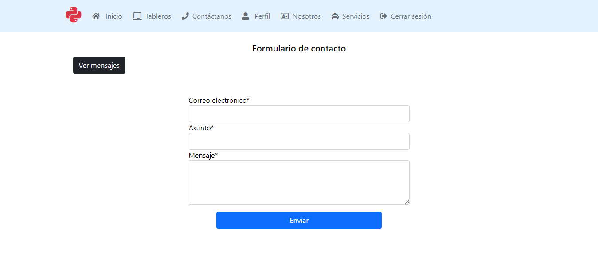
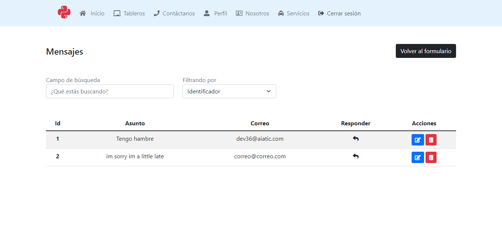
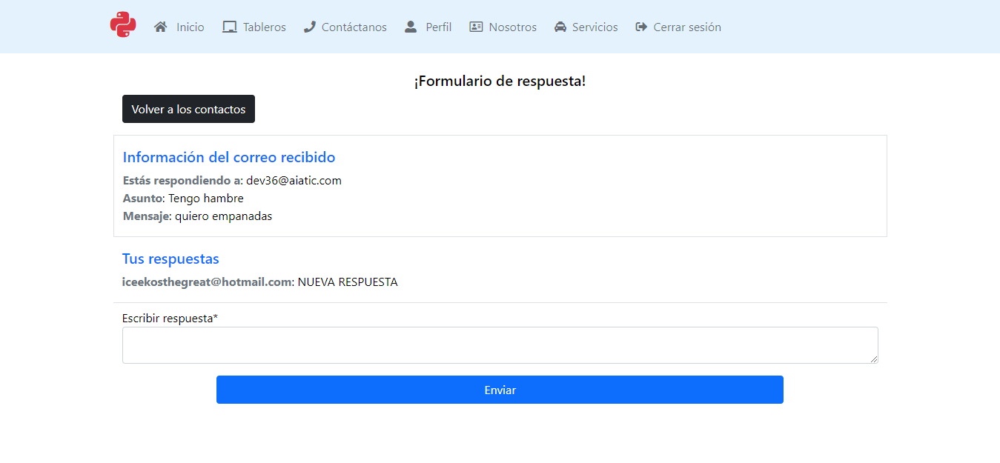

# Desarrollo Ejercicio 2

El ejercicio pedía añadirle a lo realizado en el ejercicio 1 lo siguiente

* Crear un formulario de contacto
* Responder a los mensajes enviados por le formulario con la sesión iniciada
* Listado de todos los mensajes
* Filtrar los mensajes por correo, asunto, etc.
* Eliminar o editar los mensajes con la sesión iniciada

Con el fin de cumplir estos requisitos se procedió a crear los modelos en el archivo ``models.py``

Archivo ``models.py``

    class Contact(models.Model):

        email = models.EmailField(verbose_name="Correo electrónico")
        subject = models.CharField(verbose_name="Asunto", max_length=255)
        message = models.TextField(verbose_name="Mensaje")
        created_at = models.DateTimeField(auto_now_add=True)
        updated_at = models.DateTimeField(auto_now=True)

        def __str__(self):
            return f"{ self.id } - { self.email } | { self.subject }"

    class ReplyMessage(models.Model):

        reply = models.TextField(verbose_name="Escribir respuesta")
        contact = models.ForeignKey(Contact, verbose_name= "Contacto", on_delete=models.CASCADE, null=True)
        created_at = models.DateTimeField(auto_now_add=True)
        updated_at = models.DateTimeField(auto_now=True)
        objects = UserManager()

        def __str__(self):
            return f"ID: { self.id } | Contacto: { self.contact }"

El modelo contact es el modelo creado cuando el usuario envía un correo, el modelo ReplyMessage es el modelo creado cuando el usuario responde el mensaje enviado por el contacto, las relaciones están establecidas como llaves foraneas.

Después se procedió a implementar las respectivas vistas en el archivo ``views.py``

Archivo ``views.py``

    # Vista que permite ver todos los mensajes creados por el formulario, aquí se puede hacer un CRUD de los mensajes
    class AllContactsView(TemplateView):

        template_name = 'contacts.html'

        def get_context_data(self, **kwargs):
            context = super().get_context_data(**kwargs)
            context['contacts'] = Contact.objects.all()
            return context

        def post(self, request, *args, **kwargs):
            context = self.get_context_data(**kwargs)  
            bar = self.request.POST.get('email', None)  
            context['contacts'] = 'new_variable' + ' updated'
            return self.render_to_response(context)

    # Vista que permite ver el formulario de contacto
    class ContactView(CreateView):

        form_class = AddContact
        template_name = 'form-contact.html'
        success_url = '/accounts/contact/'

        def form_valid(self, form):
            messages.success(
                self.request, f"El mensaje se ha enviado exitosamente, pronto nos pondremos en contacto contigo!")
            return super().form_valid(form)

    # Vista que permite añadir una respuesta a un mensaje enviado por el formulario
    class AddReplyView(CreateView):

        model = ReplyMessage
        form_class = AddReply
        template_name = 'form-reply-to.html'
        success_url = reverse_lazy('reply_to_contact')
        permission_classes = [permissions.IsAuthenticated]

        def get_context_data(self, **kwargs):
            context = super().get_context_data(**kwargs)
            context['replies'] = ReplyMessage.objects.filter(
                contact=self.kwargs.get('pk'))
            context['contact'] = Contact.objects.get(pk=self.kwargs.get('pk'))
            return context

        def get_initial(self, *args, **kwargs):
            initial = super().get_initial(*args, **kwargs)
            initial['contact'] = Contact.objects.get(pk=self.kwargs.get('pk'))
            return initial

        def form_valid(self, form):
            messages.success(
                self.request, f"Mensaje enviado!")
            return super().form_valid(form)

        def get_success_url(self):
            return reverse('reply_to_contact', kwargs={'pk': self.kwargs.get('pk')})

Después se definieron los enlaces en el archivo ``urls.py``

    path('contact/', login_required(ContactView.as_view()), name="contact"),
    path('contacts/', login_required(AllContactsView.as_view()), name="all_contacts"),
    path('contacts/<int:pk>/', login_required(AddReplyView.as_view()), name="reply_to_contact"),

Eso sería todo, de esta forma el usuario puede crear objetos del modelo Contacto y añadir respuestas

**Resultados**

Formulario de contacto

Ver mensajes enviados por el usuario, aquí está donde se puede hacer el CRUD de los mismos

Responder a mensaje enviado por usuario

Después se procedió a implementar las funcionalidades de borrar y editar mensajes, en ese sentido se añadieron las siguientes vistas al archivo ``views.py``

Archivo ``views.py``
   
    # Vista para borrar un modelo de Contacto
   
    class DeleteContactView(DeleteView):
        model = Contact
        form_class = AddContact
        template_name = 'form-delete-contact.html'
        success_url = reverse_lazy('all_contacts')
        permission_classes = [permissions.IsAuthenticated]

        def get_context_data(self, **kwargs):
            context = super().get_context_data(**kwargs)
            context['contact'] = Contact.objects.get(pk=self.kwargs.get('pk'))
            return context

        def get(self, request, *args, **kwargs):
            try:
                return super().get(request, *args, **kwargs)
            except Http404:
                return redirect(reverse('all_contacts'))

    # Vista para editar un modelo de Contacto
    
    class EditContactView(UpdateView):
        model = Contact
        form_class = AddContact
        template_name = 'form-edit-contact.html'
        success_url = reverse_lazy('edit_contact')
        permission_classes = [permissions.IsAuthenticated]

        def get_context_data(self, **kwargs):
            context = super().get_context_data(**kwargs)
            context['contact'] = Contact.objects.get(pk=self.kwargs.get('pk'))
            return context

        def get(self, request, *args, **kwargs):
            try:
                return super().get(request, *args, **kwargs)
            except Http404:
                return redirect(reverse('all_contacts'))

        def form_valid(self, form):
            messages.success(
                self.request, f"El mensaje ha sido editado exitosamente!")
            return super().form_valid(form)

        def get_success_url(self):
            #print(self.pk)
            return reverse('edit_contact', kwargs={'pk': self.kwargs.get('pk')})

Se definieron las rutas en el archivo ``urls.py``

Archivo ``urls.py``

    path('contacts/<int:pk>/delete/', login_required(DeleteContactView.as_view()), name="delete_contact"),
    path('contacts/<int:pk>/edit/', login_required(EditContactView.as_view()), name="edit_contact"),

y eso sería todo, una vez se haga la petición POST o GET correspondiente a las rutas definididas en el archivo ``urls.py`` se realizarán los eventos definidos anteriormente, cabe resaltar que estos formularios se encuentran en el archivo indicado en la variable ``template_name``
