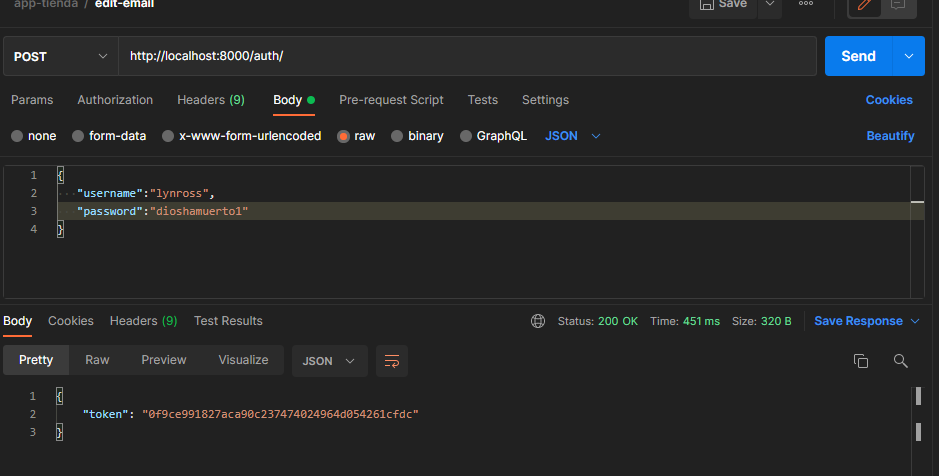

# Desarrollo Ejercicio 3

El ejercicio pedía crear los siguientes endpoints

| Método http | Endpoint     | Descripción                                                                                    |
|-------------|--------------|------------------------------------------------------------------------------------------------|
| Post        | /token       | Método que permite obtener un token de autenticación mediante username y password.             |
| Get         | /users       | Método que retorna el listado de todos los usuarios con sus diferentes atributos.              |
| Get         | /boards      | Método que retorna todos los tableros creados, permitir filtrar por estrado (privado, público) |
| Post        | /boards      | Método que permite crear un tablero por nombre y estado.                                       |
| Get         | /ideas       | Método que retorna todos las ideas creadas por usuario                                         |
| Post        | /create_idea | Método que permite crear una idea por nombre y estado.                                         |

Para obtener el token de usuario se definió la siguiente ruta en el archivo ``urls.py`` en el core de la aplicación

     path('token/', obtain_auth_token),

al hacer una petición POST y enviarle por el cuerpo un objeto JSON con propiedades username y password retorna un token de acceso como se observa a continuación

vale la pena recalcar que se hace la petición a la ruta establecida en la app, en la imagen sale auth/ sin embargo en el proyecto se utiliza token/

Con el fin de crear los demás endpoints se definieron algunas y reutilizaron otras vistas genéricas en el archivo ``views.py``

Archivo ``views.py``

    # Esta vista ya habia sido definida en el ejercicio 1

    class UserList(generics.ListAPIView):
        queryset = User.objects.all()
        serializer_class = UserSerializer
        permission_classes = [permissions.AllowAny]

    # Vista que permite crear un nuevo usuario

    class CreateUser(generics.CreateAPIView):
        serializer_class = CreateUserSerializer
        permission_classes = [permissions.AllowAny]

    # Vista que devuelve un usuario cuando se le pasa un identificador por la url

    class SingleUserView(generics.RetrieveAPIView):
        queryset = User.objects.all()
        serializer_class = UserSerializer
        permission_classes = [permissions.AllowAny]

    # Vista que elimina un usuario cuando se le pasa un identificador por la url

    class DeleteSingleUserView(generics.DestroyAPIView):
        queryset = User.objects.all()
        serializer_class = UserSerializer
        permission_classes = [permissions.AllowAny]

Después se definieron y reutilizaron serializers en el archivo ``serializers.py``

Archivo ``serializers.py``

    class UserSerializer(serializers.ModelSerializer):
        class Meta:
            model = User
            fields = ('id', 'email', 'username', 'first_name',
                    'last_name', 'id_num', 'profile_picture')

    class CreateUserSerializer(serializers.ModelSerializer):
        class Meta:
            model = User
            fields = ['first_name',
                    'last_name', 'id_num', 'profile_picture']

Por último se definieron las rutas en el archivo ``urls.py`` las cuales consumiran los métodos creados en las vistas

Archivo ``urls.py``

    path('create/', CreateUser.as_view(), name="create"),
    path('list/', UserList.as_view(), name="users_list"),
    path('user/<int:pk>/', SingleUserView.as_view(), name="single_user"),
    path('delete/<int:pk>/', DeleteSingleUserView.as_view(), name="delete_single_user"),

Y eso es todo, los endpoints han sido creados, al hacer una petición POST o GET según corresponda se enviará la respuesta correspondiente.